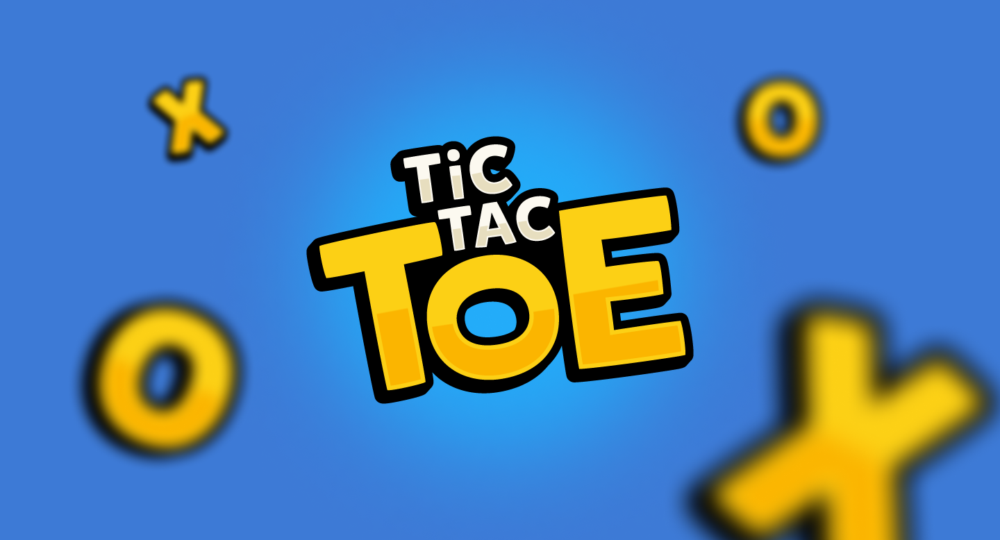

# Next.js Tic Tac Toe 🎮

A modern implementation of the classic Tic Tac Toe game built with **Next.js**, **TypeScript**, and **Framer Motion**. Features a beautiful UI, smooth animations, and advanced gameplay features like move history and undo/redo functionality.




## ✨ Features

- 🎮 **Classic Tic Tac Toe gameplay**
- 🎯 **Interactive game board** with smooth animations
- ⏪ **Undo/Redo moves**
- 📜 **Complete move history** with time travel
- 💾 **Game state persistence** using `localStorage`
- 🔗 **Shareable game states** via URL
- 📱 **Fully responsive design**
- 🎨 **Beautiful UI** with gradient backgrounds and animations
- 🎓 **Interactive "How to Play" tutorial**


## 🚀 Tech Stack

- **[Next.js 14](https://nextjs.org/)** - React framework
- **[TypeScript](https://www.typescriptlang.org/)** - Type safety
- **[Tailwind CSS](https://tailwindcss.com/)** - Styling
- **[Framer Motion](https://www.framer.com/motion/)** - Animations
- **[Radix UI](https://www.radix-ui.com/)** - UI Components
- **[Lucide Icons](https://lucide.dev/)** - Icons


## 🛠️ Installation

1. **Clone the repository:**

   ```bash
   git clone https://github.com/yourusername/nextjs-tic-tac-toe.git
   ```

2. **Install dependencies:**

   ```bash
   cd nextjs-tic-tac-toe
   npm install
   ```

3. **Run the development server:**

   ```bash
   npm run dev
   ```

4. **Open [http://localhost:3000](http://localhost:3000)** in your browser to start playing!


## 🎮 How to Play

1. The game starts with **Player X** and alternates between **X** and **O**.
2. Click on any empty square to make a move.
3. Get **three in a row** (horizontally, vertically, or diagonally) to win.
4. Use the **undo/redo buttons** to navigate through moves.
5. Click on any move in the history to **jump to that game state**.
6. Share your game state with friends using the **URL**.


## 🏗️ Project Structure

```
nextjs-tic-tac-toe/
├── app/
│   ├── components/       # React components
│   ├── layout.tsx        # Root layout
│   └── page.tsx          # Home page
├── types/                # TypeScript types
├── utils/                # Game logic utilities
└── public/               # Static assets
```


## 🧪 Key Components

### **Game Component**
The main game component that manages the game state and coordinates between different screens.

### **GameBoard Component**
Renders the game board and handles player interactions.

### **Move History**
Keeps track of all moves and allows players to time travel to previous game states.


## 📝 License

This project is licensed under the **MIT License** - see the [LICENSE](LICENSE) file for details.


## 🤝 Contributing

Contributions are welcome! Please feel free to submit a **Pull Request**.

1. **Fork the project.**
2. Create your feature branch:  
   ```bash
   git checkout -b feature/AmazingFeature
   ```
3. Commit your changes:  
   ```bash
   git commit -m 'Add some AmazingFeature'
   ```
4. Push to the branch:  
   ```bash
   git push origin feature/AmazingFeature
   ```
5. Open a **Pull Request**.


## 🙏 Acknowledgments

- Inspired by the **React tutorial's Tic Tac Toe game**.
- UI components from **[shadcn/ui](https://ui.shadcn.com/)**.
- Icons from **[Lucide Icons](https://lucide.dev/)**.

